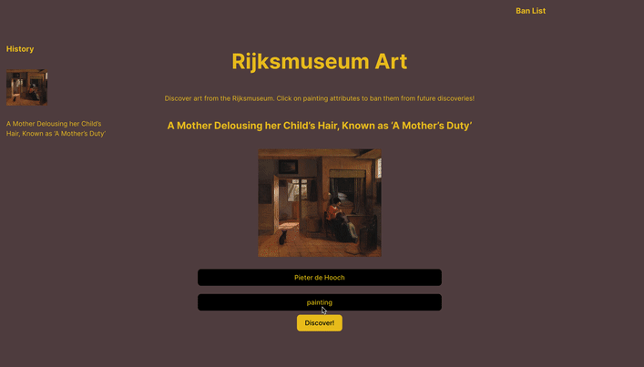

# Web Development Project 4 - *Rijksmuseum Art*

Submitted by: **Nell Brodkin**

This web app: **Discover art from the rijksmuseum and customize what you see by banning artists or types of art**

Time spent: **5** hours spent in total

## Required Features

The following **required** functionality is completed:

- [x] **Clicking a button creates a new API fetch request and displays at least three attributes from the returned JSON data**
- [x] **Only one item/API call is viewable at a time**
- [x] **API calls appear random to the user**
- [x] **At least one image is displayed per API call**
- [x] **Clicking on a displayed value for one attribute adds it to a displayed ban list**
- [x] **Attributes on the ban list prevent further images/API results with that attribute from being displayed**

The following **optional** features are implemented:

- [x] Multiple types of attributes can be added to the ban list
- [x] Users can see a stored history of their previously viewed items from their session

## Video Walkthrough

Here's a walkthrough of implemented features:

<!-- Replace this with whatever GIF tool you used! -->
GIF created with [Kap](https://getkap.co/) for macOS 
<!-- Recommended tools:
[Kap](https://getkap.co/) for macOS
[ScreenToGif](https://www.screentogif.com/) for Windows
[peek](https://github.com/phw/peek) for Linux. -->

## Notes

Future improvements would include better styling.
Images come from https://data.rijksmuseum.nl/object-metadata/api/.